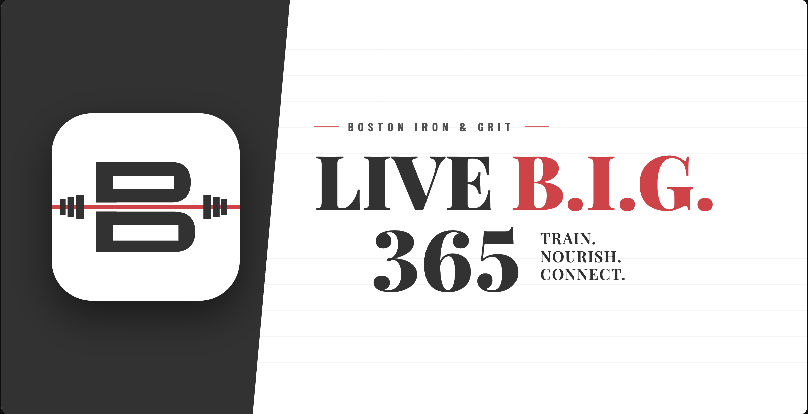

# Live B.I.G 365 ☀️

> A habit-tracking PWA for one gym's 8-week summer challenge.
> Members log 10 daily habits, the leaderboard updates live, and
> personalized weekly recap emails go out automatically.
>
> **Live:** https://livebig365.fit



---

## How I got here

I'm Sukesh — a non-technical founder, and this is the first real application I've built. The user is Tina, who owns **CrossFit Boston Iron & Grit**, and her members. The constraint was simple: data entry over an 8-week challenge that's not suited for the regular workout logging + class signup app. The gym tried a spreadsheet that doesn't update live across all users. I wanted to build something for myself and also share with gym members. 

I shipped it by pairing with [Claude Code](https://claude.com/claude-code) over a 1 week of sessions. Claude wrote most of the code. I made every product decision: which features to cut, which to fight for, what the brand should feel like, how to handle the inevitable bugs. The split that worked for me — Claude is faster than I am at translating intent into working code; I'm faster than Claude at noticing when something doesn't feel right for a real member to use.

A few things I figured out along the way that I didn't expect to —

### iPhone PWAs don't share storage with Safari

When you tap "Add to Home Screen" on iOS, the installed PWA gets its own storage container. So when members tapped a magic link in their email, the link opened in Safari (iOS won't let you override that), Safari authenticated, and the home-screen PWA stayed logged out forever. A loop you can't escape from.

The fix: switch from clickable magic links to a **6-digit code**. Members read the code from their email and type it into the PWA. Same Supabase auth call generates both — no cross-app handoff needed. iOS even surfaces the code as a keyboard suggestion thanks to `autocomplete="one-time-code"`. One configuration change and a two-step UI; the iOS install experience went from broken to seamless.

### A retry loop took down the admin Quotes tab

I shipped an offline write queue so members could log habits without internet and have them sync when they reconnected. What I didn't notice: failed writes (RLS errors, schema mismatches) retried forever. Stuck entries saturated the Supabase JS client's connection pool and made the admin Quotes tab spin on "Loading…" indefinitely. Tina flagged it; I spent a confused evening tracing it back. Fix was an 8-attempt cap and a 7-day TTL on queued writes. Ugly, but bounded.

The lesson: any retry loop without a stop condition will eventually become the bug. I'm not going to make that mistake again.

### Time zones bit me

`new Date().toISOString()` is UTC. East Coast members logging habits at 9pm got their entry recorded as the *next* day. Spotted by Tina during testing. Fixed by building the date string from `getFullYear/Month/Date()` so the day rolls over at the user's local midnight, not UTC midnight.

### "Move fast" still needs taste

The brief I started from assumed Next.js + React + TypeScript. I went with vanilla HTML/CSS/JS in a single file because — honestly — I can read and edit one HTML file, and I couldn't reason about a sprawling React codebase under deadline. Trade-off documented in [`RISKS.md`](RISKS.md): the file is now ~3,500 lines and a refactor is a future-me problem when there are more contributors. For now, one file means one place to grep, one file to deploy, zero build step. I'll take it.

The rest of the trade-offs (Edge Function URL auth, single-file maintainability, offline queue caps tuned reactively, day-rollover trusting browser clock, no cron-failure alerting) are in [`RISKS.md`](RISKS.md) — nothing's hidden.

---

## What it actually does

### For members
- **Sign in with email + 6-digit code** — no password, 30-day session
- **Log 10 daily habits** — Train, Stretch, Sleep, Fast, Veggies, Hydrate, plus the **Big 3** (No Alcohol, No Bread, No Sugar) at 5 points each. Up to **26 points/day, 1,456 across the program**
- **Weekly view** — habits × days grid, tap any cell to backfill a missed day. Current week locks Mon–Fri and opens Saturday so the gym fills it in together
- **Live leaderboard** — podium, badges, week + total tabs
- **Sunday personal recap email** + **Tuesday group standings email**
- **Add to home screen** — installs as a PWA on iOS/Android

### For Tina (gym owner / admin)
- Manual point lock-in every Wednesday
- Per-week override on any member's total (preserves daily data)
- Curated quote rotation (members submit, admin approves)
- Member roster + invite controls
- Feedback widget on every screen — pings her Slack instantly

---

## Stack

- **Frontend:** Single-file vanilla HTML/CSS/JS (`index.html`) loading `supabase-js` from a CDN. ~3,500 lines. No build step.
- **Auth + DB:** Supabase (Postgres + email OTP)
- **Edge Functions:** Deno + TypeScript (`supabase/functions/`) — Sunday recap and Tuesday digest cron jobs
- **Transactional email:** Resend with custom domain (`noreply@livebig365.fit`)
- **Hosting:** Vercel — static deploy + one Node serverless function (`api/notify-slack.js`) for inbound feedback
- **PWA:** `site.webmanifest` + apple-touch-icon for home-screen install

---

## Repo layout

```
.
├── index.html                                # the entire client app
├── api/
│   └── notify-slack.js                       # Vercel serverless fn for feedback → Slack
├── supabase/
│   ├── email_templates/
│   │   └── magic_link.html                   # paste-into-dashboard sign-in code email
│   └── functions/
│       ├── _shared/helpers.ts                # HABITS array, week math, brand chrome
│       ├── weekly-recap/                     # Sunday 8am EDT cron
│       └── leaderboard-digest/               # Tuesday 9pm EDT cron
├── site.webmanifest                          # PWA manifest
├── HANDOFF.md                                # one-time setup + deploy steps
└── RISKS.md                                  # known tech debt / fragility
```

---

## Setup + deploy

Full one-time wiring (Supabase secrets, Edge Function deploys, Resend domain, redirect-URL allowlist, JWT expiry, magic-link template, cron schedules) lives in [`HANDOFF.md`](HANDOFF.md). For a local preview:

```sh
python3 -m http.server 4000
# open http://localhost:4000
```

The Supabase URL + publishable key are inlined in `index.html` — both are public values, safe to commit.

---

## Built with

- [Claude Code](https://claude.com/claude-code) — pair-programming partner
- [Supabase](https://supabase.com/) — auth, Postgres, Edge Functions
- [Resend](https://resend.com/) — transactional email
- [Vercel](https://vercel.com/) — static hosting + serverless

— Sukesh Shekar
